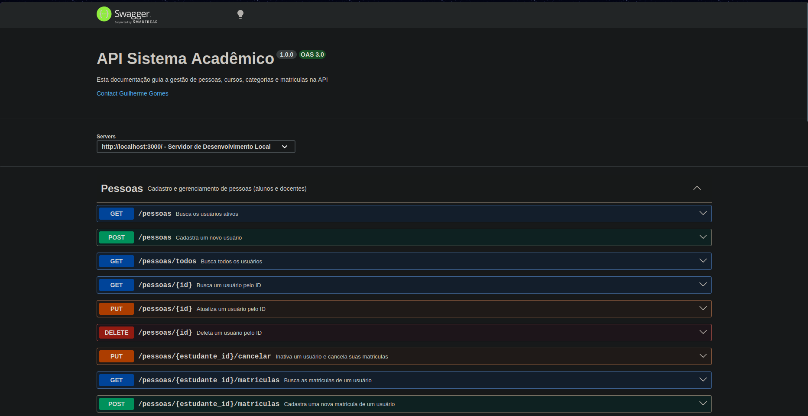

# 🎓 API de Gestão Acadêmica

<div align="center">


</div>

---

## 📖 Sobre o Projeto

A **API de Gestão Acadêmica** é uma API REST desenvolvida com **Node.js**, **Express.js**, **Sequelize** e **SQLite**, simulando o funcionamento de um sistema acadêmico.

O projeto utiliza a arquitetura MVC em conjunto com uma camada de Services para separar responsabilidades entre rotas, regras de negócio e acesso aos dados.

Além das operações CRUD, a API oferece paginação, busca dinâmica, validações, Soft Delete, tratamento centralizado de erros e documentação com Swagger.

---

## 📸 Preview



---

## 🎯 Objetivos do Projeto

Este projeto foi desenvolvido para aprofundar conhecimentos em APIs REST utilizando Node.js e Express, aplicando conceitos como arquitetura MVC, Service Layer, Sequelize ORM, relacionamentos entre entidades, transações, Soft Delete e documentação com OpenAPI (Swagger).

---

## ✨ Funcionalidades

- CRUD de Pessoas (Estudantes e Docentes)
- CRUD de Cursos
- CRUD de Categorias
- Gerenciamento de Matrículas
- Busca dinâmica via Query Parameters
- Paginação reutilizável
- Ordenação personalizada
- Soft Delete com Sequelize (Paranoid)
- Transações para operações críticas
- Validação automática de IDs
- Validação de campos e duplicatas
- Tratamento global de erros
- Middleware para páginas inexistentes (404)
- Campos pesquisáveis centralizados em constantes
- Documentação interativa com Swagger
- Padronização de código com ESLint

---

## 🛠 Tecnologias

### Backend


### Banco de Dados


### Ferramentas


---

## 🏗️ Arquitetura

A aplicação foi organizada em camadas, separando responsabilidades entre rotas, controllers, services e models.

```text
                 HTTP Request
                       │
                       ▼
                  Express Router
                       │
                       ▼
                 Middlewares
        (Busca • Paginação • IDs)
                       │
                       ▼
                 Controllers
                       │
                       ▼
                   Services
                       │
                       ▼
               Sequelize Models
                       │
                       ▼
                  SQLite Database
```

Cada camada possui uma função bem definida, reduzindo o acoplamento e facilitando futuras alterações no projeto.

---

## 📂 Estrutura do Projeto

```text
.
├── src
│   ├── constants
│   │   └── queryCampos
│   │       ├── entidades
│   │       └── index.js
│   ├── controllers
│   ├── database
│   │   ├── config
│   │   ├── migrations
│   │   ├── models
│   │   ├── seeders
│   │   └── storage
│   ├── errors
│   ├── middlewares
│   ├── routes
│   ├── services
│   ├── utils
│   │   └── helpers
│   └── app.js
├── swagger.yaml
├── .eslintrc.json
├── .sequelizerc
├── server.js
├── package.json
└── README.md
```

---

## 📁 Organização das Camadas

| Diretório | Responsabilidade |
|------------|------------------|
| **controllers/** | Recebem as requisições HTTP e delegam o processamento para os Services |
| **services/** | Implementam as regras de negócio e comunicação com os Models |
| **database/models/** | Definição das entidades e relacionamentos do Sequelize |
| **database/migrations/** | Versionamento da estrutura do banco de dados |
| **database/seeders/** | Dados iniciais utilizados durante o desenvolvimento |
| **routes/** | Definição de todas as rotas da aplicação |
| **middlewares/** | Validações, paginação, busca, tratamento de erros e controle das requisições |
| **errors/** | Classes responsáveis pelo tratamento padronizado de exceções |
| **constants/** | Centralização dos campos permitidos para consultas e filtros |
| **utils/helpers/** | Funções utilitárias reutilizadas em toda a aplicação |

---

## 🚀 Como Executar

### Clone o repositório

```bash
git clone https://github.com/mguilhermegomes/api-rest-faculdade-sqlite.git
```

### Acesse a pasta do projeto

```bash
cd api-rest-faculdade-sqlite
```

### Instale as dependências

```bash
npm install
```

### Configure o arquivo `.env`

```env
DEV_PORT=3000
```

### Execute as migrations

```bash
npx sequelize-cli db:migrate
```

### Popule o banco de dados

```bash
npx sequelize-cli db:seed:all
```

### Inicie a aplicação

```bash
npm run dev
```

A API estará disponível em:

```text
http://localhost:3000
```

---

## 📖 Documentação da API

A API possui documentação interativa em **Swagger (OpenAPI 3.0)**, permitindo explorar todos os endpoints, parâmetros, modelos de dados e testar as operações diretamente pelo navegador.

Após iniciar o servidor, a documentação pode ser acessada em:

```text
http://localhost:3000/api-docs
```

---

## ⭐ Destaques Técnicos

- Arquitetura MVC + Service Layer
- CRUD genérico com Services reutilizáveis
- Middlewares reutilizáveis
- Paginação, ordenação e busca dinâmica
- Validação automática com Sequelize
- Soft Delete (Paranoid)
- Transactions
- Scopes e Associations
- Tratamento centralizado de erros
- Swagger OpenAPI

---

## 📚 Próximas Melhorias

- Autenticação com JWT
- Testes unitários e de integração
- Docker e Docker Compose
- PostgreSQL
- Pipeline de CI/CD
- Deploy em ambiente de produção

---

## 🤝 Contribuindo

Contribuições são sempre bem-vindas.

Caso tenha sugestões de melhorias, correções ou novas funcionalidades:

1. Faça um Fork do projeto;
2. Crie uma nova branch para sua feature;

```bash
git checkout -b feature/minha-feature
```

3. Realize suas alterações;

4. Faça o commit:

```bash
git commit -m "feat: adiciona nova funcionalidade"
```

5. Envie para seu repositório:

```bash
git push origin feature/minha-feature
```

6. Abra um Pull Request.

---

## 👨‍💻 Autor

**Guilherme Gomes**  

Estudante de Informática e desenvolvedor full stack em formação, com foco em desenvolvimento backend utilizando Node.js, Express, Sequelize e APIs REST.

Projeto desenvolvido durante meus estudos em Node.js e Sequelize com o objetivo de praticar arquitetura em camadas, modelagem de banco de dados e construção de APIs REST

🔗 **LinkedIn:** <https://www.linkedin.com/in/mguilherme-gomes/>  
🔗 **GitHub:** <https://github.com/mguilhermegomes>

---

## 📄 Licença

Este projeto está licenciado sob a **MIT License**. 

Consulte o arquivo **LICENSE** para mais informações.

---

<div align="center">

### ⭐ Obrigado por visitar este repositório!

Se este projeto contribuiu para o seu aprendizado ou serviu como referência, considere deixar uma estrela no GitHub.

**Boas práticas constroem bons softwares. Bons softwares constroem grandes desenvolvedores. 🚀**

</div>
